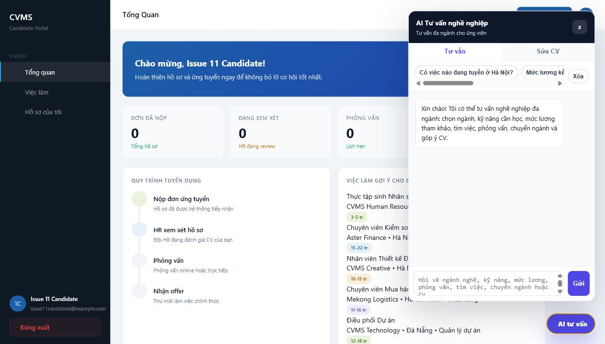
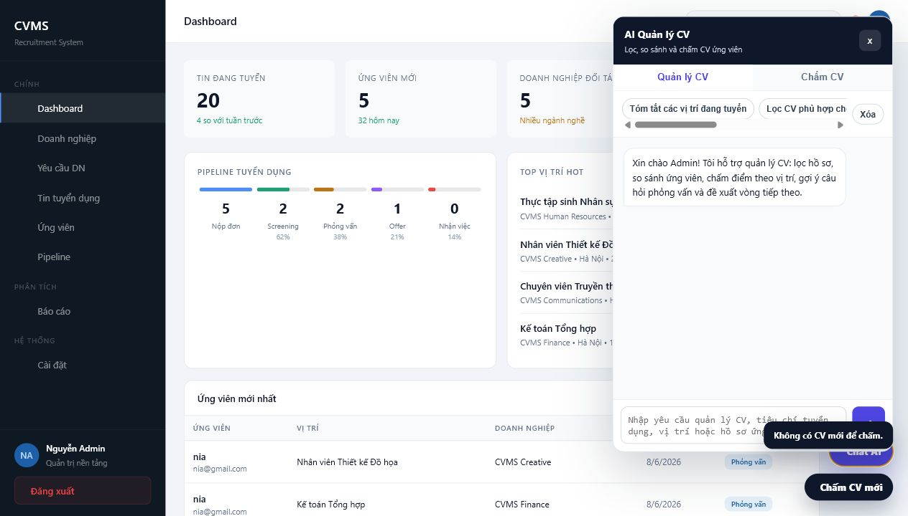

# Issue #11 Evidence - Chatbot AI CVMS

Issue: https://github.com/hieunofun/cong-nghe-phan-mem/issues/11

Branch evidence: `issue-11-development-evidence`

## Screenshots

Candidate chatbot on candidate dashboard:



Admin chatbot with CV scoring entry point:



## API test evidence

Raw result: `issue-11-api-test-result.json`

Test server:

```text
http://localhost:4301
```

Commands used:

```powershell
node --check scripts/serve.mjs
node --check jss/ai-chatbot-widget.js
node --check jss/login.js

Invoke-RestMethod -Method POST http://localhost:4301/api/chat `
  -ContentType 'application/json' `
  -Body '{"message":"muc luong ke toan khoang bao nhieu","mode":"user_career"}'

Invoke-RestMethod -Method POST http://localhost:4301/api/chat `
  -ContentType 'application/json' `
  -Body '{"message":"tom tat cac vi tri dang tuyen va checklist cham CV","mode":"admin_cv_manage"}'
```

Observed result:

| Case | Intent | Category | Mode | Fallback |
| --- | --- | --- | --- | --- |
| Candidate no-accent salary question | `hoi_luong` | `tai_chinh` | `user_career` | `true` |
| Admin CV checklist question | `hoi_cv` | `chung` | `admin_cv_manage` | `true` |

## Checklist mapping

| Checklist item | Evidence |
| --- | --- |
| Quick prompts | Screenshots show role-specific chips for candidate/admin. |
| Vietnamese no-accent detection | API result maps `muc luong ke toan` to `hoi_luong` and `tai_chinh`. |
| Clear chat history | Screenshots show `Xoa` button in chatbot toolbar. |
| Fallback without/invalid API key | API result has `fallback: true` and warning instead of HTTP failure. |
| CVMS data-aware answers | Chatbot API builds context from jobs, companies and applications in `scripts/serve.mjs`. |
| Admin and candidate UI QA | Candidate and admin screenshots are included. |
| Docs/QA updated | `docs/ISSUE_11_CHATBOT_QA.md` and this evidence file document scope, tests and expected behavior. |

